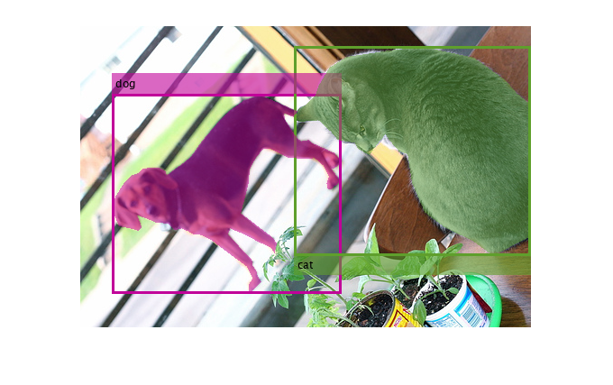
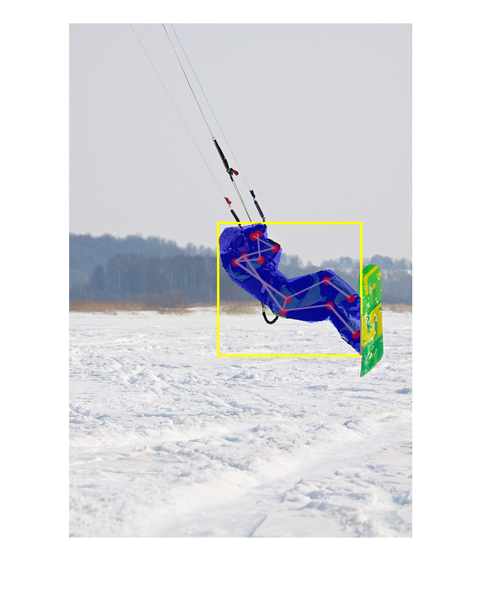
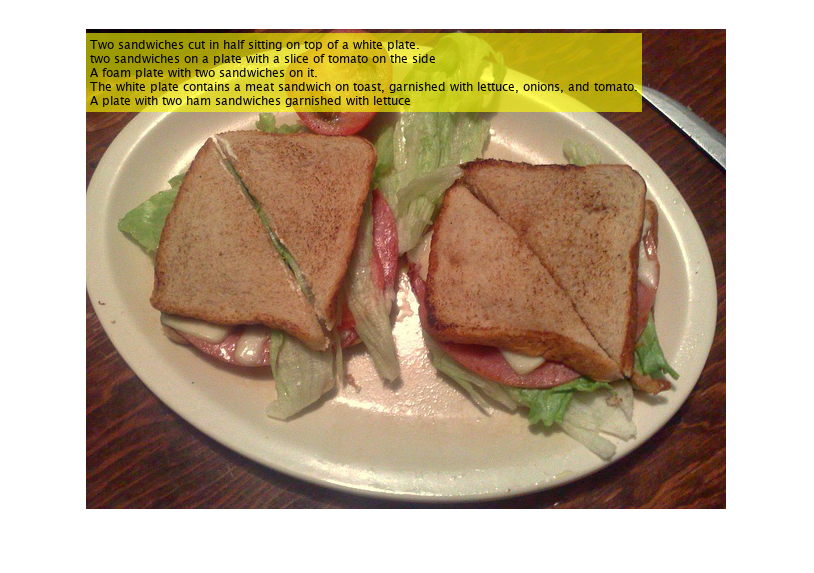

# COCO-API


# **OverView**
> As we all know, the [COCO2014/2017](https://cocodataset.org/#home) dataset is widely used for object detection, instance segmentation, image description, key point detection, panoramic segmentation and many other tasks, the official has provided cocoapi's python, matlab, lua language interface, but in matlab using the interface provided by the program is very poor readability, not easy to intuitively clear, the use of people This program makes full use of the characteristics of the table type to enrich the expression of coco datasets, with only about 100 lines of code to achieve the "instances", "keypoints" ,"captions" level of API, without any third-party libraries, can be customized to modify the API, code readability.<br>

# **Syntax**

- **[allCOCOdata,cocoDatastore,cocoNames]=cocoInstancesAPI(imagesDir,annotationFile,categoryNames)**

**功能**：优雅的实现coco2014，coco2017数据集instances新接口 

 **输入**：
`imagesDir`，string类型，1*1大小，输入COCO图像文件根目录

`annotationFile`，string类型，1*1大小，与之对应的标注json文件

`categoryNames`，（可选项）string类型，1*N大小，物体类别，默认所有类别`


**输出**：
`allCOCOdata`， table类型，所有带有标注的完整信息，每行代表一副图像

`cocoDatastore`，TransformedDatastore object，可就地迭代对象

`cocoNames`，categorical类型，80个类别`

- **[allCOCOdata,cocoDatastore,keyPtsNames,skeleton]=cocoKeyPointsAPI(imagesDir,annotationFile)**

**功能**：优雅的实现coco2014，coco2017数据集keypoints新接口


 **输入**：

`imagesDir`，string类型，输入COCO图像文件根目录

`annotationFile`，string类型，与之对应的标注json文件


** 输出**：

`allCOCOdata`， table类型，所有带有标注的完整信息，每行代表一副图像

`cocoDatastore`，TransformedDatastore object，可就地迭代对象

`keyPtsNames`，categorical类型数组，长度为17，分别为人体各个部位id顺序名字

`skeleton`，double类型数组，M*2大小，人体部位各个id连接情况，第一列与第二列id进行连接


- **[allCOCOdata,cocoDatastore] = cocoCaptionsAPI(imagesDir,annotationFile)**

**功能**：优雅的实现coco2014，coco2017数据集Captions新接口

**输入**：

`imagesDir`，string类型，输入COCO图像文件根目录

`annotationFile`，string类型，与之对应的标注json文件


**输出**：

`allCOCOdata`， table类型，所有带有标注的完整信息，每行代表一副图像

`cocoDatastore`，TransformedDatastore object，可就地迭代对象


# Requirements

   -  MatlabR2020b or higher 
   
   - [coco2014 or 2017 datasets (images and annotations)](https://cocodataset.org/#download ) 

# **How to use**


一般做object detection/segmention/keypoints/captions,训练任务都会用到可迭代的datasets，比如对上述三类API返回数据`cocoDatastore`进行[迭代使用](https://www.mathworks.com/help/matlab/ref/matlab.io.datastore.transformeddatastore.html ),read会从内存中读取部分数据，读取的数据直观上应当有以下返回形式数据格式：

data = [read](https://www.mathworks.com/help/matlab/ref/matlab.io.datastore.read.html)(cocoDatastore)


根据不同任务的API，返回元胞数组data中的元素有如下直观形式。

   -  RGB images (H x W x 3) 
   -  Bounding boxes (NumObjects x 4,  arranged as [x y w h]) 
   -  Labels (NumObjects x 1), categorical 
   -  Masks (H x W x NumObjects)  
   -  KeyPoints (17×3×NumObjects) 
   -  Captions(NumSentences x 1 cell array) 

# Example1, instance

```
% coco path
imagesDir = '\\192.168.1.103\dataSets\coco2017\val2017\val2017';
annotationFile = '\\192.168.1.103\dataSets\coco2017\annotations_trainval2017\annotations\instances_val2017.json';
yourNames = ["dog","cat"]; % optional
% coco-api
[allCOCOdata,cocoDatastore,coconames] = cocoInstancesAPI(imagesDir,...
    annotationFile,yourNames);

head(allCOCOdata) % preview,Get top rows of table
```

| |image_id|license|file_name|coco_url|height|width|date_captured|flickr_url|GroupCount|segments|iscrowd|bbox|category_id|
|:--:|:--:|:--:|:--:|:--:|:--:|:--:|:--:|:--:|:--:|:--:|:--:|:--:|:--:|
|1|1675|1|'000000001675.jpg'|'http://images.cocod...|480|640|'2013-11-18 00:14:32...|'http://farm1.static...|1|1x1 cell|0|[0,14.0100,640,293.5...|17|
|2|4795|1|'000000004795.jpg'|'http://images.cocod...|480|640|'2013-11-17 21:07:53...|'http://farm1.static...|1|1x1 cell|0|[152.7700,113.5500,3...|17|
|3|7386|3|'000000007386.jpg'|'http://images.cocod...|400|600|'2013-11-15 12:44:58...|'http://farm5.static...|1|1x1 cell|0|[180.9100,281.1400,3...|18|
|4|10363|1|'000000010363.jpg'|'http://images.cocod...|361|640|'2013-11-15 07:08:52...|'http://farm4.static...|1|1x1 cell|0|[245.5100,108.3000,2...|17|
|5|14007|3|'000000014007.jpg'|'http://images.cocod...|426|640|'2013-11-24 11:03:51...|'http://farm8.static...|1|1x1 cell|0|[340.2500,153.3800,7...|17|
|6|14831|1|'000000014831.jpg'|'http://images.cocod...|640|480|'2013-11-17 19:58:56...|'http://farm9.static...|1|1x1 cell|0|[1.4400,232.9900,478...|17|
|7|15497|1|'000000015497.jpg'|'http://images.cocod...|480|640|'2013-11-18 00:19:02...|'http://farm3.static...|1|1x1 cell|0|[32.3600,20.4900,451...|17|
|8|17029|4|'000000017029.jpg'|'http://images.cocod...|640|640|'2013-11-18 14:33:10...|'http://farm8.static...|1|1x1 cell|0|[154.8400,105.8100,2...|18|


```
colormap = randi(255,length(coconames),3);
cocoDatastore = shuffle(cocoDatastore); % random 
while cocoDatastore.hasdata()
    data = read(cocoDatastore);
    img = data{1};  % origin image(H×W×C)
    bboxs = data{2}; % Bounding boxes (NumObjects x 4,  arranged as [x y w h])
    labels = data{3};% Labels (NumObjects x 1), categorical
    masks = data{4}; % Masks (H x W x NumObjects) 
   
    colors = colormap(arrayfun(@(x)find(x==coconames),labels),:);
    draw = insertObjectAnnotation(img,'rectangle',bboxs,labels,...
        'LineWidth',3,...
        'Color',colors);
    for i = 1:size(masks,3)
        draw = labeloverlay(draw,masks(:,:,i),...
            'Colormap',colors(i,:)/255,...
            'Transparency' , 0.5);
    end
    
    imshow(draw)
    break;
end
```




# Example2, keypoints

```
imagesDir='\\192.168.1.103\dataSets\coco2017\val2017\val2017';
annotationFile = '\\192.168.1.103\dataSets\coco2017\annotations_trainval2017\annotations\person_keypoints_val2017.json';
[allCOCOdata,cocoDatastore,keyPtsNames,skeleton] = ...
    cocoKeyPointsAPI(imagesDir,annotationFile);
head(allCOCOdata) % preview,Get top rows of table
```

| |image_id|license|file_name|coco_url|height|width|date_captured|flickr_url|GroupCount|segments|bbox|keypoints|
|:--:|:--:|:--:|:--:|:--:|:--:|:--:|:--:|:--:|:--:|:--:|:--:|:--:|
|1|139|2|'000000000139.jpg'|'http://images.cocod...|426|640|'2013-11-21 01:34:01...|'http://farm9.static...|1|1x1 cell|[412.8000,157.6100,5...|17x3    double|
|2|785|4|'000000000785.jpg'|'http://images.cocod...|425|640|'2013-11-19 21:22:42...|'http://farm8.static...|1|1x1 cell|[280.7900,44.7300,21...|17x3    double|
|3|872|4|'000000000872.jpg'|'http://images.cocod...|640|621|'2013-11-23 00:37:47...|'http://farm9.static...|2|[{3x1,cell,};{1x9...|[145.2600,100.6700,2...|17x3x2  double|
|4|885|4|'000000000885.jpg'|'http://images.cocod...|427|640|'2013-11-21 02:00:45...|'http://farm4.static...|3|[{1x90,double};{1...|3x4 double|17x3x3  double|
|5|1000|4|'000000001000.jpg'|'http://images.cocod...|480|640|'2013-11-21 05:13:59...|'http://farm5.static...|12|12x1 cell|12x4 double|17x3x12 double|
|6|1268|4|'000000001268.jpg'|'http://images.cocod...|427|640|'2013-11-17 05:57:24...|'http://farm6.static...|4|[{1x106,double,};\...|4x4 double|17x3x4  double|
|7|1296|5|'000000001296.jpg'|'http://images.cocod...|640|427|'2013-11-24 08:22:26...|'http://farm5.static...|2|[{1x96,double};{1...|[7.1600,1.5700,419.8...|17x3x2  double|
|8|1353|3|'000000001353.jpg'|'http://images.cocod...|500|375|'2013-11-17 04:33:52...|'http://farm3.static...|5|[{2x1,cell,};{1x1...|5x4 double|17x3x5  double|


```
cocoDatastore = shuffle(cocoDatastore); % random
while cocoDatastore.hasdata()
    data = read(cocoDatastore);
    img = data{1};   % origin image(H×W×C)
    bboxs = data{2}; % Bounding boxes (NumObjects x 4,  arranged as [x y w h])
    masks = data{3}; % Masks (H x W x NumObjects)
    keyPts = data{4}; % KeyPoints (17×3×NumObjects)
    
    % plot
    draw = insertObjectAnnotation(img,'rectangle',bboxs,"",...
        'LineWidth',3);
    for i = 1:size(masks,3)
        draw = labeloverlay(draw,masks(:,:,i));
    end
    draw = drawSkeleton(draw,keyPts,skeleton);
    
    imshow(draw)
    break;
end
```




# Example3,captions

```
imagesDir = '\\192.168.1.103\dataSets\coco2017\val2017\val2017';
annFile = '\\192.168.1.103\dataSets\coco2017\annotations_trainval2017\annotations\captions_val2017.json';
[allCOCOdata,cocoDatastore] = cocoCaptionsAPI(imagesDir,annFile);
head(allCOCOdata) % preview,Get top rows of table
```

| |image_id|license|file_name|coco_url|height|width|date_captured|flickr_url|GroupCount|captions|
|:--:|:--:|:--:|:--:|:--:|:--:|:--:|:--:|:--:|:--:|:--:|
|1|139|2|'000000000139.jpg'|'http://images.cocod...|426|640|'2013-11-21 01:34:01...|'http://farm9.static...|5|[{'A,woman,stands,i...|
|2|285|4|'000000000285.jpg'|'http://images.cocod...|640|586|'2013-11-18 13:09:47...|'http://farm8.static...|5|[{'A,big,burly,griz...|
|3|632|3|'000000000632.jpg'|'http://images.cocod...|483|640|'2013-11-20 21:14:01...|'http://farm2.static...|5|[{'Bedroom,scene,wi...|
|4|724|1|'000000000724.jpg'|'http://images.cocod...|500|375|'2013-11-17 09:30:58...|'http://farm4.static...|5|[{'A,stop,sign,is,m...|
|5|776|1|'000000000776.jpg'|'http://images.cocod...|640|428|'2013-11-20 01:00:50...|'http://farm2.static...|5|[{'Three,teddy,bear...|
|6|785|4|'000000000785.jpg'|'http://images.cocod...|425|640|'2013-11-19 21:22:42...|'http://farm8.static...|5|[{'A,woman,posing,f...|
|7|802|6|'000000000802.jpg'|'http://images.cocod...|640|424|'2013-11-24 10:59:09...|'http://farm5.static...|5|[{'A,kitchen,with,a...|
|8|872|4|'000000000872.jpg'|'http://images.cocod...|640|621|'2013-11-23 00:37:47...|'http://farm9.static...|5|[{'A,couple,of,base...|


```
cocoDatastore = cocoDatastore.shuffle();
while cocoDatastore.hasdata()
    data = read(cocoDatastore);
    img = data{1};   % origin image(H×W×C)
    captions = data{2}; % captions (NumSentences x 1 cell array)

    % caption
    draw = insertText(img,[1,5],strjoin(captions,'\n'));
    imshow(draw);
    break;
end
```




# SupportFunction

```
function drawRGB = drawSkeleton(image,keyPts,skeleton)
% 功能：在输入图像image上绘制人体骨架图,只绘制标注过的点线
% 输入：
%    image
%           大小为H*W*C，输入图像
%    keyPts
%            double类型数组，大小为17*3*NumObjects; 17个点，3表示[x,y,flag]，
%            flag=0,表示这个关键点没有标注（这种情况下x=y=flag=0），flag为1时
%            表示这个关键点标注了但是不可见（被遮挡了），flag为2时表示这个关键
%            点标注了同时也可见.
%   skeleton
%           double类型数组，大小为M*2,表示coco中17个点连接情况，数据表示ID序号
% 输出：
%     drawRGB
%           大小为H*W*C，输出图像
%
% author:cuixingxing
% cuixingxing150@gmail.com
% 2021.8.11
%
arguments
    image
    keyPts (17,3,:) double
    skeleton (:,2) double
end
drawRGB = image;
Radus = 5;
numObjs = size(keyPts,3);
colormaps = randi(255,numObjs,3);
for i = 1:numObjs
    currentKPts = keyPts(:,:,i);% 17*3, [x,y,flag]
    validIdx = currentKPts(:,3)~=0;
    
    validKPts = currentKPts(validIdx,:);
    radius = Radus*ones(sum(validIdx),1);
    drawRGB = insertShape(drawRGB,...
        'FilledCircle',[validKPts(:,1:2),radius],...
        'Color','red');
    
    validID = find(validIdx);
    connectionValidID = ismember(skeleton(:,1),validID)&...
        ismember(skeleton(:,2),validID);
    connectionValid = skeleton(connectionValidID,:);
    x1 = currentKPts(connectionValid(:,1),1);
    y1 = currentKPts(connectionValid(:,1),2);
    x2 = currentKPts(connectionValid(:,2),1);
    y2 = currentKPts(connectionValid(:,2),2);
    lines = [x1,y1,x2,y2];
    drawRGB = insertShape(drawRGB,'Line',lines,...
        'Color',colormaps(i,:),...
        'LineWidth',2);
end
end

```

# Reference


[1] [coco-datasets](https://cocodataset.org/)


[2] [COCO数据集的标注格式](https://zhuanlan.zhihu.com/p/29393415)


